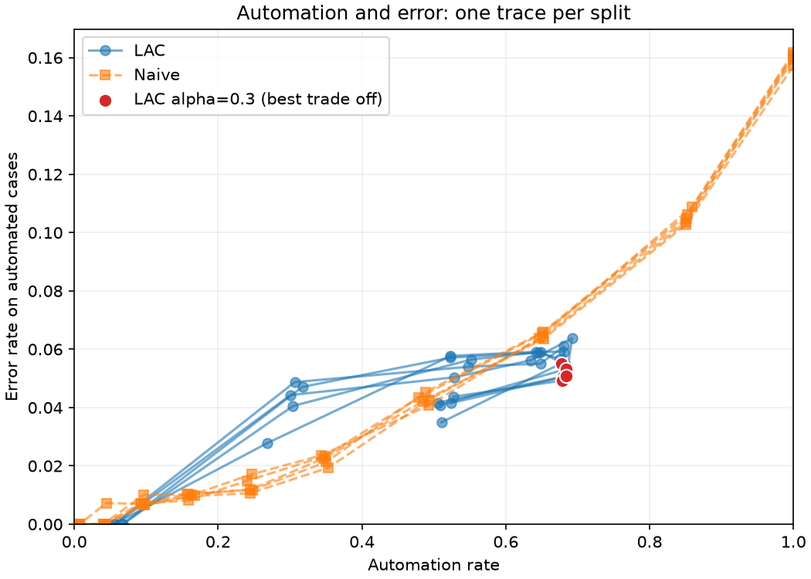
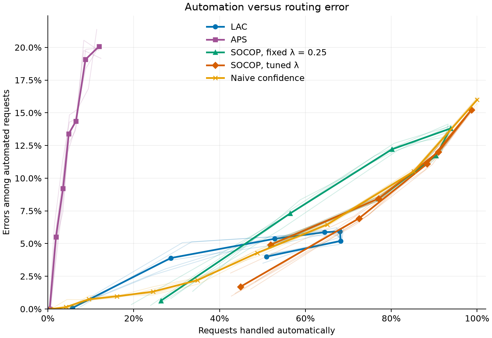

# Conformal Banking: From Classifiers to LLMs

[](https://github.com/EnzoCanonero/conformal-selective-prediction/actions/workflows/ci.yml)

## Conformal prediction for automation: from classifiers to LLMs

When should a model handle a customer request automatically, and when should a
person take over? This project investigates that question using **conformal
prediction**, a way to keep several possible answers instead of always forcing
the model to choose one.

We start with conventional classifiers trained to recognise banking-support
categories, then move towards **large language models (LLMs)** on the same task.
We compare how many requests each approach handles automatically and how often
those decisions are wrong, testing whether conformal prediction helps us decide
which requests to hand to a person.

### A shared workflow

Consider a customer writing, “The ATM kept my card.” The classifier and the
planned LLM will both follow these steps:

- **Use known answers to decide how strict the shortlist should be.** A model
  reporting “80% confidence” is not necessarily right 80% of the time, so we
  examine its predictions on a separate collection of requests whose correct
  answers are already known. Those examples show how strongly the model favours
  the correct categories and let us set a rule for which answers to retain on
  new requests. This is calibration. A longer shortlist can protect the correct
  answer while leaving us unable to choose a single category automatically.

- **Build a shortlist for each new request.** Rather than immediately accepting
  the model's favourite support category, conformal prediction keeps the
  categories that meet the rule learned during calibration. This shortlist of
  possible answers is called a prediction set.

- **Route the request or ask a person to review it.** We route automatically
  only when the shortlist contains one category. If several answers remain
  plausible, or none makes the list, a person reviews the request instead.

### What does the coverage guarantee give us?

- **Coverage asks whether the correct answer is still on the list.** For the
  ATM request, a list containing both “card retained by an ATM” and “failed cash
  withdrawal” counts as covered: the right answer is present, even though we
  still need a person to choose between the two. This is why coverage and the
  accuracy of automatic routing are different things.

- **A 90% target is a statistical promise, not a fixed result for every run.**
  The guarantee is that the correct answer is retained in at least nine out of
  ten cases on average, assuming calibration and future requests are drawn
  independently from the same unchanged population. That average includes
  repeating calibration with new examples. The particular examples used can
  make one run more or less cautious than another, so a run can fall below 90%
  even when it receives many requests.

- **Keeping the right answer available does not guarantee correct automation.**
  The promise is not about getting nine out of ten automatic decisions right,
  and some support categories can fare worse than others. We therefore measure
  automatic-routing errors and results for individual categories separately,
  rather than treating coverage as a general certificate of reliability.

- **The protection can change when the requests change.** If incoming requests
  shift from familiar card questions to unfamiliar fraud complaints, for
  example, the earlier calibration may no longer provide the same protection.

## BANKING77: one task, a shared benchmark

BANKING77 contains about 13,000 short English banking-support requests. Each
has one of 77 **intents**: the kind of help the customer needs, such as finding a
missing card or checking a pending transfer. The easily confused categories make
human review relevant, and the dataset is small enough for repeated experiments.

Both classifiers and the planned LLM will choose from **the same 77 categories**.
The LLM's job is classification, not writing customer replies or taking banking
actions. We compare them on the same official test requests, using separate
examples to calibrate each model. The [data guide](data/README.md) explains the
source, setup and limitations.

## Milestones

| Milestone | Status | Purpose |
|:----------|:-------|:--------|
| Synthetic validation | Complete | Check the method on generated data under controlled conditions. [Report](docs/synthetic_validation.md). |
| BANKING77 baseline | Complete | Establish what a simple word-based classifier can automate. [Report](docs/banking77_validation.md). |
| Score comparison | Implemented | Compare LAC, APS and SOCOP using the same classifier and test requests. [Report](docs/banking77/score_comparison/comparison.md). |
| Representation comparison | Next | Compare word-based features with a pretrained text encoder, keeping its weights fixed and using the same classifier family and routing rules. |
| LLM comparison | Planned | Compare the same routing rule across classifiers and an LLM. |
| Changing conditions | Planned | Test whether changing instructions or incoming requests requires updating calibration. |

## First results on BANKING77

The first experiment uses a classifier that learns to recognise support
categories from the words in a request. Alongside the conformal shortlist rule,
we test a simpler **confidence rule**: accept the model's top answer when its
confidence score is above a chosen cutoff. Both rules use the same model.

The conformal rule used here is **LAC**. It considers each intent separately,
keeping it when the probability assigned by the classifier meets a cutoff
learned during calibration. Several intents can pass, or none can; the rule
does not explicitly favour a shortlist containing exactly one answer.

At a **90% coverage target**, the conformal shortlist contains the correct answer
for **90.08% of test requests**. It routes **53.49% automatically**, of which
**5.51% are wrong**. These results are averages from five runs that change which
examples are used for training and calibration, while keeping the test requests
the same.

### How much automation, at what error rate?

We tested several configurations of both methods, varying **the coverage target
for the conformal method (LAC)** and **the confidence cutoff for the naive rule**.
Every configuration was evaluated in all five runs described above. Within each
run, both methods used the same classifier and test requests, so the comparison
concerns the routing rules rather than different models.

- **Our preferred high-automation trade-off is LAC with a 70% coverage target
  (`alpha=0.3`).** It retains almost all the automation achieved at the 80%
  coverage target, but with fewer mistakes among the requests handled
  automatically. This makes it the configuration we highlight from the tested
  high-automation choices.

- **The closest tested naive configuration uses a 20% confidence cutoff
  (`tau=0.2`).** Its average automation rate is the nearest to that LAC setting,
  making it the relevant comparison for asking which rule makes fewer mistakes
  while handling a similar amount of work.

The table shows the average results across the five runs:

| Rule and chosen setting | Requests handled automatically | Wrong answers among those handled |
|:------------------------|-------------------------------:|----------------------------------:|
| LAC, 70% coverage target (`alpha=0.3`) | 68.08% | 5.18% |
| Naive, 20% confidence cutoff (`tau=0.2`) | 65.06% | 6.46% |

At these settings, LAC handles **3.02 percentage points more requests** while
reducing the error rate among those handled by **1.28 percentage points**.
Both improvements hold in each of the five runs.

Other choices are possible. A stricter naive cutoff can achieve lower error by
automating less, while a requirement for 90% set coverage would rule out this
70% LAC configuration. The highlighted choice therefore reflects a favourable
high-automation balance in this experiment, not a setting that is best for every
requirement.

The curves below put this comparison in context by showing **all evaluated
configurations**, including choices that prioritise lower error over greater
automation.



- The **horizontal axis** shows the proportion of requests handled automatically,
  while the **vertical axis** shows the proportion of those decisions that are
  wrong. At the same automation rate, a lower point indicates fewer routing
  errors; at the same error rate, a point further right indicates more automation.

- The **blue curves** represent conformal selection (labelled “LAC”), and the
  **orange curves** represent the confidence rule (“Naive”). Each method has five
  curves, one per run. The points along a curve correspond to different settings
  applied to the same model and test requests within that run.

- The **red points** mark the 70% conformal coverage target used in the table.
  The “best trade off” label refers to the high-automation choice discussed
  above. It was highlighted after examining the results, not selected as a
  deployment policy.

Coverage also varies across support categories, and the calibration and test
data contain different proportions of intents. The
[BANKING77 report](docs/banking77_validation.md) discusses these limitations,
explains the curve shapes and presents the remaining results.

## Comparing shortlist rules: LAC, APS and SOCOP

The follow-up study keeps the same five classifiers and test requests, but
compares the LAC baseline with APS and SOCOP. The model's predictions stay the
same; what changes is how we turn them into a shortlist.

- **APS builds the shortlist from ranked probabilities.** It orders intents
  from most to least likely and adds their probabilities as it moves down the
  list. Our implementation keeps an intent only if the total, including that
  intent, does not exceed a limit learned during calibration. Spread-out
  probabilities can produce a long shortlist; if even the first intent exceeds
  the limit, the set is empty.

- **SOCOP is designed to produce more one-answer shortlists.** It balances that
  aim against the size of the sets left for review. Favouring single answers
  more strongly can increase automation, but leave broader shortlists for the
  requests that still need a person. It changes the routing trade-off, not the
  classifier's ability to recognise the correct intent.

We compare a fixed SOCOP configuration with settings selected on separate
labelled examples for each coverage target, choosing those that produce the
most one-label sets. Individual choices use tuning data only and are made
before final calibration. However, the candidate grid was expanded after
preliminary test results were inspected, so this comparison remains exploratory.
Reserving examples for tuning leaves fewer for calibration, so the fresh LAC
results differ slightly from the original study above.



The plot shows how much work each rule automates and how often those decisions
are wrong. Moving right means more automation; moving down means fewer mistakes
among automated requests. Bold curves show five-run means, faint curves show
individual runs, and points represent different coverage targets or confidence
cutoffs.

- **LAC offers a competitive balance around two-thirds automation.** It makes
  fewer mistakes than the nearby tested confidence cutoff. That setting uses
  a 70% coverage target, however, so it is not an option when higher prediction-set
  coverage is required.

- **APS is not effective for automatic routing in this configuration.** It
  usually returns several labels or no label, leaving few requests automated.
  Those few are not reliably the easiest cases: at the 90% coverage target,
  automation is only 3.53%, with 9.22% error among automated requests.

- **SOCOP offers two particularly interesting tuned configurations**, depending
  on how much automation is needed and how many errors can be accepted:

  - **95% coverage target: more automation.** It automates **72.49%** of requests
    with **6.93% mean error**, versus 65.06% and 6.46% for the tested 20%
    confidence cutoff. More requests are handled automatically, at a modest
    increase in the proportion of mistakes—not an improvement on both measures.

  - **99% coverage target: fewer errors.** It automates **44.90%** with **1.70%
    mean error**, compared with 34.84% and 2.20% for the tested 40% confidence
    cutoff. Both improvements hold in four of five runs. The mean below 2%
    is not an enforced error ceiling.

  - **Pushing automation further has a cost.** At the 85% coverage target,
    tuned SOCOP automates 98.68% but makes errors in 15.23% of those decisions.
    The curves then turn back: lowering coverage first turns multi-label sets
    into singletons, but eventually produces empty sets that require review again.

- **Naive confidence remains competitive at several settings.** Stricter
  cutoffs can reduce errors by accepting fewer requests, making this simple
  rule an important baseline. Unlike the conformal methods, it does not provide
  a calibrated prediction set with a coverage target.

**The best trade-off depends on the goal:** handling more requests automatically,
making fewer routing errors, or retaining the correct intent at a higher coverage
target. In this study, tuned SOCOP stands out for combining high coverage with
substantial automation, particularly at 95% and 99%. LAC and naive confidence
remain competitive at several settings, so there is no single best choice for
every requirement. High coverage does not guarantee few mistakes among automated
decisions, and SOCOP's broad deferred sets can still leave considerable work for
a human reviewer.

The [full score comparison](docs/banking77/score_comparison/comparison.md)
explains these exploratory findings, coverage, review-set sizes and limitations.

## Repository structure

```text
src/conformal_selective_prediction/   # Reusable methods, data loading and classifier
examples/
├── synthetic_multiclass.py           # Self-contained example
├── banking77_baseline.py             # One BANKING77 run, step by step
├── banking77_validation.py           # Historical LAC baseline across several runs
└── banking77_scores/                 # Shared preparation, score studies and comparison
tests/                               # Checks for the mathematics and routing rules
docs/                                # Reports and saved figures
data/README.md                       # Dataset setup and limitations
.github/workflows/ci.yml             # Automated checks
pyproject.toml                       # Package and tool configuration
```

Automated checks cover tests, code style and types. Downloaded data and generated
outputs stay local; the report figures are saved in Git.

## Installation and running

Use Python 3.12 or later. From the repository root, on macOS/Linux:

```bash
python -m venv .venv
source .venv/bin/activate
python -m pip install -e ".[example,dev]"
```

This installs the examples and development tools. For the NumPy-only library,
use `python -m pip install -e .`.

Start with the synthetic example, which needs no downloaded data:

```bash
python examples/synthetic_multiclass.py
```

For BANKING77, first follow the [data setup instructions](data/README.md).
Then run the step-by-step example or the comparison across several runs:

```bash
python examples/banking77_baseline.py
python examples/banking77_validation.py
```

Results are saved to `outputs/banking77/`, replacing same-named files when rerun.
The reports explain how to reproduce them.

## License

Code is available under the [MIT License](LICENSE). BANKING77 has a separate
dataset license, documented in [data/README.md](data/README.md#source).
