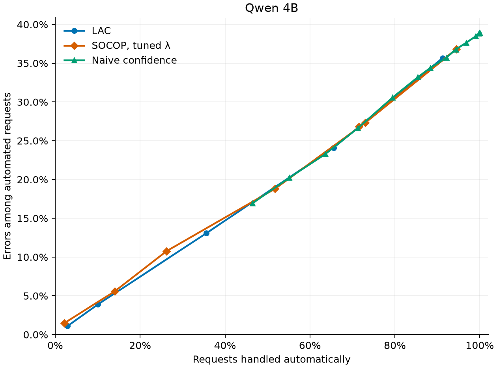
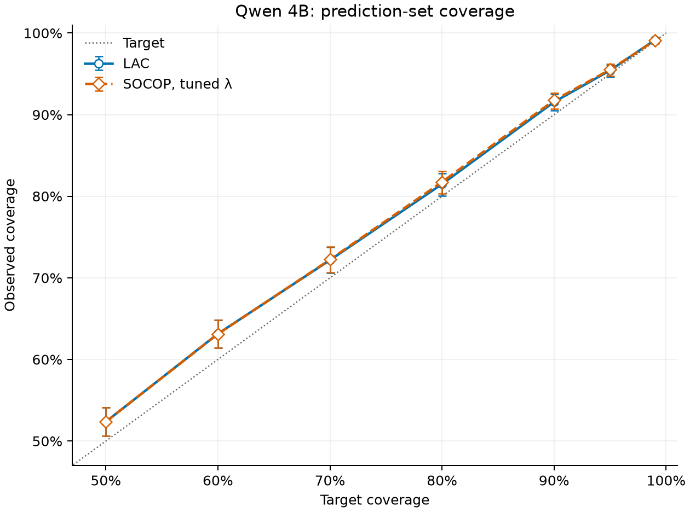
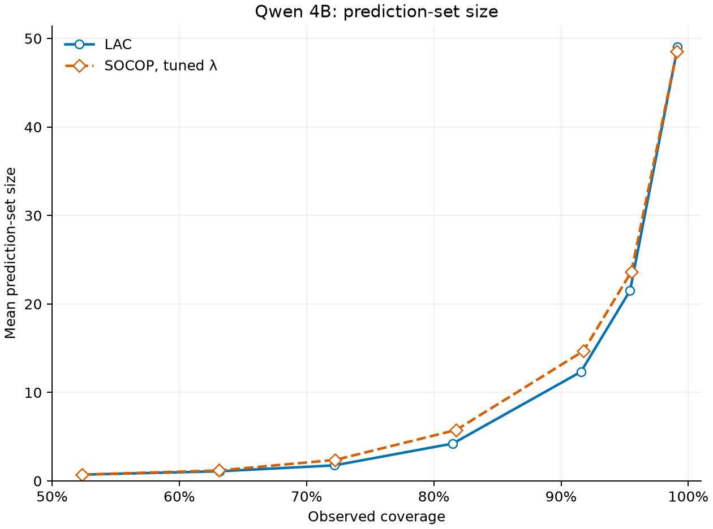

# LLM ScoreKit

[](https://github.com/EnzoCanonero/llm-scorekit/actions/workflows/ci.yml)

This project uses **conformal prediction** to decide when a classifier or large
language model (LLM) should handle a request automatically and when it should
leave the decision to a person. It combines reusable calibration and routing
functions with BANKING77 studies comparing word-based classifiers, a frozen
text encoder and a local Qwen model.

The emphasis is on what these decisions mean in practice: how much work is
automated, how often automatic decisions are wrong, and how useful the remaining
choices are for a reviewer. The experiments distinguish those outcomes from
conformal's statistical promise of retaining the correct answer in a calibrated
set of possible answers.

## What's here

- **A reusable decision layer** implements LAC, APS and SOCOP prediction sets,
  calibration and routing, with metrics for coverage, automation and errors.
- **Classifier and LLM studies** apply the same decision rules to BANKING77,
  including local Qwen scoring whose saved results can be reused without
  repeating inference.
- **Notebooks, runnable examples and reports** connect the implementation to
  worked examples and explain the results, their practical costs and limitations.

### A shared workflow

For a request such as “The ATM kept my card”:

- **Score the possible intents.** Each model ranks the banking-support categories.
  The classifiers learn from labelled requests; Qwen uses a fixed prompt to
  score each category name as a possible answer, without task-specific training.
- **Calibrate a shortlist.** Separate requests with known answers determine
  which categories to retain for a chosen coverage target. We compare LAC,
  which checks each category's score separately; APS, which uses cumulative
  scores in ranked order; and SOCOP, which favours one-answer sets while
  penalising broad lists.
- **Route or review.** One retained category means automatic routing. Several
  categories, or none, mean human review. We compare this with **naive confidence
  thresholding**: accept the model's top answer above a fixed cutoff, otherwise
  defer it.

### Why conformal prediction?

**Coverage measures whether the correct answer remains in the prediction set.**
For the ATM request, keeping both “card retained by an ATM” and “failed cash
withdrawal” counts as covered when the first is correct, even though a person
must still choose. Conformal uses separate labelled examples to calibrate which
answers to retain, rather than treating the model's confidence as a verified
probability of being right.

At a 90% target, the guarantee is at least 90% coverage on average, assuming
calibration and future requests come independently from the same unchanged
population. This average includes new calibration samples as well as future
requests, so it is not a promise that every run or batch will meet the target.

**This calibrated coverage promise is what the fixed naive cutoff does not
provide, even when the two methods have similar automation/error curves.**
It concerns the prediction sets, including those sent to review, not the error
rate among automatic decisions or coverage for every support category. The
protection can also change when incoming requests change, so useful routing
still requires examining errors and the work left for human review.

## Main results

BANKING77 contains about 13,000 short English banking-support requests, each
labelled with one of 77 **intents**, such as a missing card or a pending transfer.
The closely related categories make it a useful setting for deciding when to
defer. All systems choose among these same categories; the LLM classifies
requests rather than writing replies or taking banking actions.

The results below use one shared split and all **3,080 official test requests**,
with separate training-set examples for tuning and calibration. They are not
the five-run averages reported in the score and representation studies.

### How much can Qwen automate, and at what error rate?

We use the local, 4-bit `Qwen3-4B-Instruct-2507` without task-specific training.
A fixed prompt asks it to identify the intent, and we score each possible
category name as an answer. LAC, tuned SOCOP and naive confidence then use the
same saved scores to decide which requests to automate.



The plot shows how automation changes as we vary the conformal coverage target
or the naive confidence cutoff. The horizontal axis is the fraction of requests
handled automatically; the vertical axis is the fraction of those decisions
that are wrong. Blue is LAC, orange is SOCOP and green is naive confidence.
Lines connect tested settings on the same requests, not an optimal frontier.

At the 95% coverage target, SOCOP trades a higher error rate for more automation:
it handles **13.99%** of requests with **5.57%** error, compared with LAC's
**2.92%** and **1.11%**. Neither improves both measures.
Naive confidence remains competitive where the evaluated settings overlap;
there is no clear overall routing advantage for conformal in that region.
The naive grid has no nonzero-automation point below 46.43%, so the comparison
does not establish equivalence in the low-automation region.

### What does calibrated coverage add?

<p>
  
  
</p>

The left plot compares requested and observed coverage for LAC (blue) and SOCOP
(orange), with approximate 95% Wilson intervals. Both retain the correct intent
at or above every tested target, even though Qwen's top answer is correct on
only **61.04%** of requests. This illustrates what conformal adds: a calibrated
set of alternatives tied to a coverage target, rather than simply accepting or
rejecting the top answer. Under the assumptions described above, that set comes
with a coverage promise that the fixed naive cutoff does not provide; it is
not a guarantee on errors among automated decisions.

The right plot shows the cost of retaining those alternatives: average set size
across all test requests rises sharply with observed coverage. At the **99%
target**, both methods keep roughly **49 of the 77 intents** on average. The
correct answer remains available more often, but the reviewer may still face a
long list of possibilities. Calibration therefore adds statistical protection
for the set without repairing the model's ability to choose the right answer.

### How much does the underlying model matter?

The table compares Qwen with two classifiers using **tuned SOCOP at a 95%
coverage target**, calibrated separately on the same records. Both classifiers
use logistic regression trained on 7,502 labelled requests: one represents
text with word TF-IDF features, while the other uses vectors from a frozen
MiniLM encoder. Unlike Qwen, they receive task-specific training, so this is
a comparison of the evaluated systems, not matched training budgets.

| System | Observed coverage | Automation | Automated-case error |
|:-------|------------------:|-----------:|---------------------:|
| Word TF-IDF + logistic regression | 95.13% | 69.71% | 6.66% |
| Frozen encoder + logistic regression | 95.71% | 86.95% | 4.82% |
| Qwen 4B, prompted label scoring | 95.52% | 13.99% | 5.57% |

All three reach similar coverage, but the encoder handles far more requests
than Qwen with a lower observed error rate. TF-IDF also automates much more,
though with a higher error rate. The distinction is practical:
retaining the correct answer in a set is useful, but the underlying model
determines how much work can be automated while keeping mistakes low.

These findings concern one Qwen model, prompt and scoring rule, not all LLMs.
The comparison is exploratory, with prior test inspection and unknown
pretraining exposure. BANKING77's official splits also differ in intent
mixture and contain text overlaps, as explained in the [data guide](data/README.md#split-limitations).
Reaching the coverage targets empirically does not establish that the
guarantee's assumptions hold for this benchmark.

## Explore the reports

The studies build on one another, from checking the methods on generated data
to evaluating a local LLM. The [documentation index](docs/README.md) collects
the reports, supporting notebooks and execution guides.

The [synthetic validation](docs/synthetic/validation.md) establishes the
foundation under controlled conditions. Repeated simulations check whether
coverage behaves as expected, while a trained multiclass example shows how
LAC, APS and SOCOP produce different sets and automation rates despite sharing
a coverage target.

The [TF-IDF and LAC baseline](docs/banking77/baseline/tfidf_lac.md) then brings
the workflow to real banking-support requests. A simple word-based classifier
provides the scores, and repeated training/calibration splits compare LAC with
naive confidence. This gives a first practical reference: LAC improves on some
tested confidence settings, but does not dominate the full routing trade-off.

With those classifier predictions held fixed, the
[score comparison](docs/banking77/scores/lac_aps_socop.md) asks whether changing
how sets are built improves automation. It examines APS and SOCOP alongside
LAC, including SOCOP tuning on examples reserved separately from calibration.
The report explains why APS automates little in this setup and how SOCOP's
useful high-coverage choices can leave broader sets for review.

The [representation study](docs/banking77/representations/tfidf_vs_encoder.md)
changes the source of the scores instead, replacing word-based features with
a frozen text encoder while keeping logistic regression and the routing rules.
It shows a substantial improvement for both LAC and SOCOP, while naive
confidence remains competitive. This separates the benefit of better text
representations from the benefit of conformal calibration itself.

The [Qwen study](docs/banking77/llm/qwen.md) extends the same decision layer to
an LLM without task-specific training. It uses a fixed prompt to score possible
intent names, then applies the routing rules to those saved scores. The report
examines both the promise and the practical cost of calibration: high coverage
is achievable, but often through limited automation and long lists for review.

Finally, the [Qwen–classifier comparison](docs/banking77/llm/qwen_vs_classifiers.md)
evaluates all three systems on the same records, using one matched split rather
than the five-run averages of the earlier studies. It puts the LLM results in
perspective against TF-IDF and the frozen encoder, showing why similar coverage
can accompany very different automation rates. The conclusions remain specific
to these systems, which have different task-specific training histories.

## Repository guide

| Location | Role in the project |
|:---------|:--------------------|
| [src/conformal_selective_prediction/](src/conformal_selective_prediction/) | Reusable scores, calibration, routing, metrics and model helpers |
| [examples/](examples/README.md) | Runnable synthetic and BANKING77 studies, including cached LLM scoring |
| [notebooks/](notebooks/) | Guided exploration of the methods and LLM scoring |
| [docs/](docs/README.md) | Reports, interpretation and reviewed figure snapshots |
| [tests/](tests/), [CI](.github/workflows/ci.yml) | Checks for the mathematics, routing rules, code style and types |
| [data/](data/README.md), `outputs/` | Dataset instructions and local experiment artifacts; downloaded data and generated outputs are not version-controlled |

## Run locally

Use Python 3.12 or later. From the repository root, on macOS/Linux:

```bash
python -m venv .venv
source .venv/bin/activate
python -m pip install -e ".[example,dev]"
```

This installs the examples and development tools. For the NumPy-only library,
use `python -m pip install -e .`. Start without downloaded data:

```bash
python -m examples.synthetic.multiclass
```

For BANKING77, follow the [data setup](data/README.md), then run:

```bash
python -m examples.banking77.baseline.single_run
python -m examples.banking77.baseline.validation
```

Results go to `outputs/banking77/`, replacing same-named files when rerun.
The [encoder guide](examples/banking77/representations/README.md) and
[LLM guide](examples/banking77/llm/README.md) cover their optional dependencies,
preparation and evaluation. Local Qwen inference uses MLX on Apple silicon;
once its scores are saved, routing comparisons can run without repeating
model inference.

## What's next

The next study will change the prompt while keeping the original calibration
threshold, then recalibrate on separate examples to examine whether coverage
persists or is restored. This tests how the decision layer behaves when the
conditions behind its calibration change.

The reusable functions will also be consolidated into a small interface for
calibrating, saving and applying a decision policy to scores from other models.
The scope remains classification with a fixed set of labels, not a general
evaluator of free-form generated answers or a deployed automation service.

## License

Code is available under the [MIT License](LICENSE). BANKING77 has a separate
dataset license, documented in [data/README.md](data/README.md#source).
