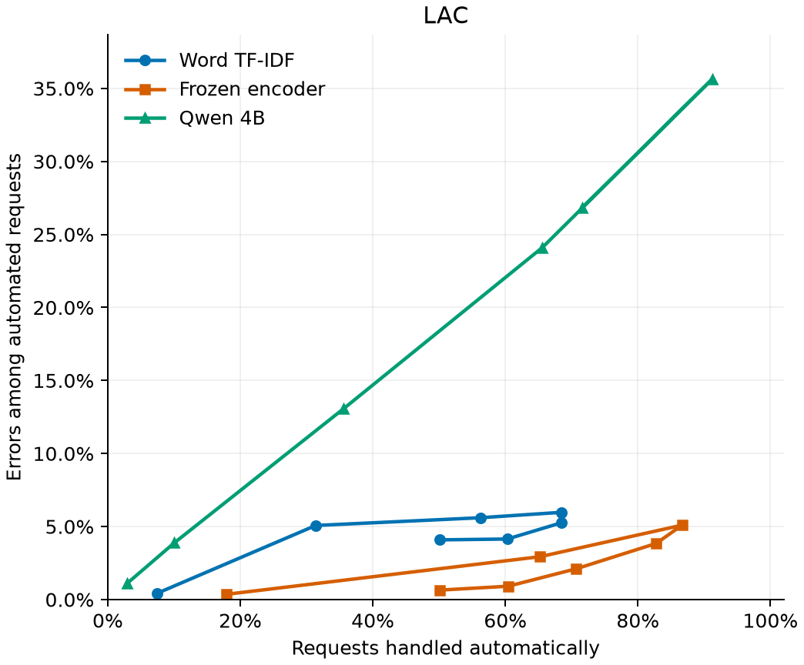
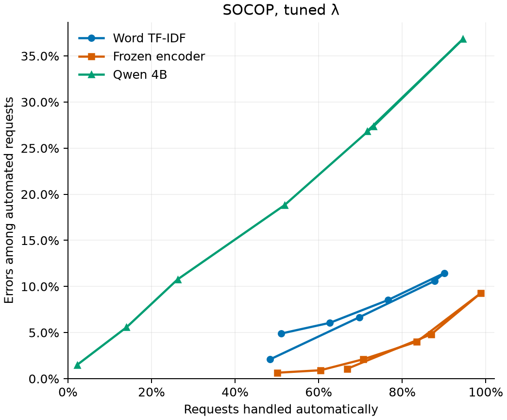

# BANKING77: Qwen versus TF-IDF and a frozen encoder

[All reports](../../README.md)

**The frozen encoder provides the strongest automation/error trade-off among
the systems compared here.** Qwen reaches the requested prediction-set coverage,
but at high targets it defers most requests and leaves broad sets for review.
We compare prompted LLM scores with classifiers trained for this task, using
the same routing rules.

## What is being compared?

- **Three systems with different training histories.** Word TF-IDF and the
  frozen `all-MiniLM-L6-v2` encoder each feed logistic regression with the same
  settings, trained on 7,502 labelled BANKING77 requests. The 4-bit
  `Qwen3-4B-Instruct-2507` receives a fixed prompt and scores the 77 intent names,
  without task-specific training. Training budgets are therefore not matched.
  The [Qwen study](qwen.md) explains its setup and individual results.
- **Identical evaluation records.** Seed 42 gives two tuning halves of 625,
  1,251 separate final-calibration requests and all 3,080 official test requests.
  Saved predictions are aligned by record ID and intent order. These are
  single-run results, not the five-run means in the earlier
  [representation study](../representations/tfidf_vs_encoder.md).
- **Shared rules, calibrated separately.** LAC retains intents above a
  calibrated weight cutoff. SOCOP favors one-label sets; its lambda setting is
  chosen separately for each model and coverage target on the tuning halves.
  Both automate only one-label sets. Naive confidence accepts the top answer
  above a cutoff. Models share the target, lambda and confidence grids, but not
  fitted thresholds or selected lambdas. Test results do not choose a
  deployment policy.

**Coverage** measures whether the correct intent remains in the prediction set,
including cases sent to review. **Automated-case error** measures the fraction
of automatic decisions that are wrong. Matching coverage targets therefore does
not mean matching automation or error rates.

## A common 95% coverage target

Overall accuracy is measured without deferral; the remaining columns use
**tuned SOCOP at the same 95% coverage target**.

| Model | Overall accuracy | Coverage | Automation | Automated-case error |
|:--|--:|--:|--:|--:|
| Word TF-IDF + logistic regression | 84.06% | 95.13% | 69.71% | 6.66% |
| Frozen encoder + logistic regression | 89.90% | 95.71% | 86.95% | 4.82% |
| Qwen 4B, prompted label scoring | 61.04% | 95.52% | 13.99% | 5.57% |

All three reach the target empirically. The encoder handles far more requests
than Qwen with a lower observed error rate. TF-IDF also automates much more,
though with a higher error rate. Similar coverage does not mean equally useful
routing.

## How the trade-off changes across targets

<p>
  
  
</p>

The horizontal axis shows automation and the vertical axis shows the error
rate among automated requests. The plots share axis limits: blue circles are
TF-IDF, orange squares the encoder and green triangles Qwen. Points follow
coverage-target order. Lines connect tested settings, not confidence bands or
an estimated optimum; selected SOCOP lambdas can also change between targets.

- **LAC: Qwen's low-error settings sacrifice much more automation.** At the
  90% target, encoder LAC automates 86.66% with 5.10% error, versus Qwen's 10.03%
  and 3.88%. Qwen's lower error at that setting does not make it the better
  router: almost nine out of ten requests still need review. The performance
  gap is therefore not specific to SOCOP.
- **SOCOP: the encoder offers useful choices at both 95% and 99%.**

  - At **95%**, the table shows its advantage in automation and error rate.
    Deferred sets also average 8.81 intents, compared with Qwen's 27.31, so the
    remaining review work involves substantially shorter lists.
  - At **99%**, encoder automation remains 66.79% with 1.07% error, versus
    Qwen's 2.18% and 1.49%. The small difference in observed error is not a
    demonstrated statistical advantage; the automation gap is the important
    practical distinction. Neither observed error rate is a guaranteed ceiling.

## Conclusions and limits

- **The encoder is the stronger reference in this setup.** It combines better
  underlying classification with more useful high-coverage routing choices.
  At the 95% SOCOP target, it automates 86.95% with 4.82% error, compared with
  Qwen's 13.99% and 5.57%. TF-IDF also automates much more than Qwen (69.71%),
  but with a higher error rate (6.66%). The same broad automation gap appears
  with LAC, so the result is not specific to SOCOP.
  Conformal calibration can retain correct answers by widening sets, but it
  cannot repair Qwen's underlying ranking mistakes.
- **Routing curves do not capture conformal's full statistical value.**
  Unlike the fixed naive cutoffs, conformal calibration builds prediction sets
  with a marginal-coverage promise under exchangeability. Similar automation
  and error rates therefore do not make the rules interchangeable when set
  coverage matters. This promise concerns retaining the correct intent, not
  bounding automated-case error; the [Qwen conclusions](qwen.md#conclusions-and-limits)
  explain the distinction and its assumptions.
- **This is not a conclusion about all LLMs.** We have not isolated the effects
  of prompt wording, scoring, model size or quantization. Improving those choices
  requires separate development data.
- **The comparison remains exploratory.** There is one split, earlier notebook
  development and a previously inspected 500-request test subset. Pretraining
  exposure is unknown. The [official split limitations](../../../data/README.md#split-limitations),
  including unequal intent mixtures and normalized text overlaps, also apply.
  Meeting coverage targets empirically does not establish exchangeability,
  reliability for every intent or coverage for changed future requests.

## Reproduction

Regenerate the comparison from saved predictions, without training or inference:

```bash
python -m examples.banking77.llm.compare
```

The [running guide](../../../examples/banking77/llm/README.md) covers the required
artifacts. Tables and source hashes are saved under
`outputs/banking77/llm/full/comparison/`. Figures here are snapshots; refresh
them together with the reported numbers.
