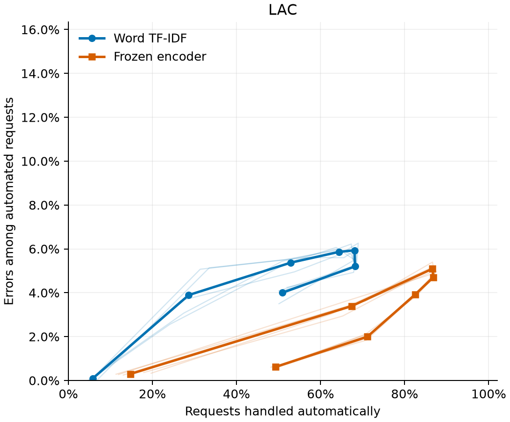
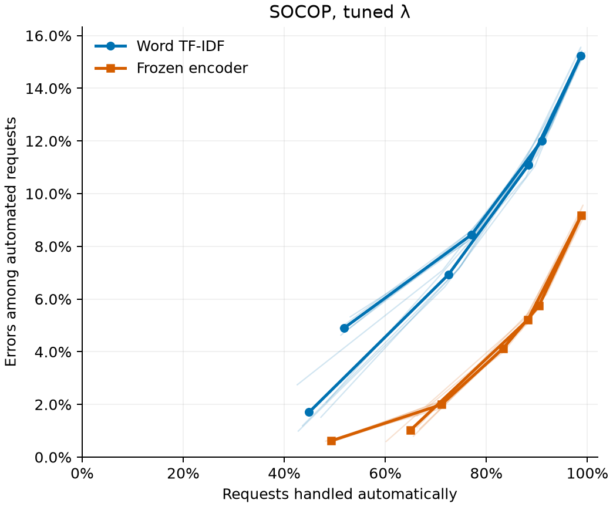
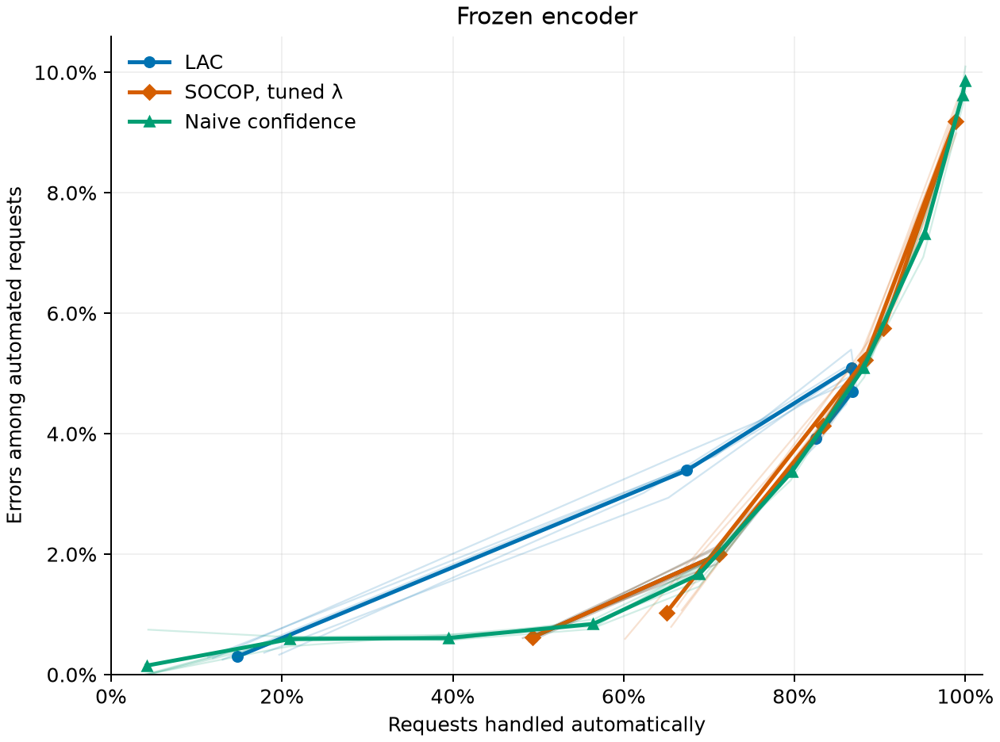
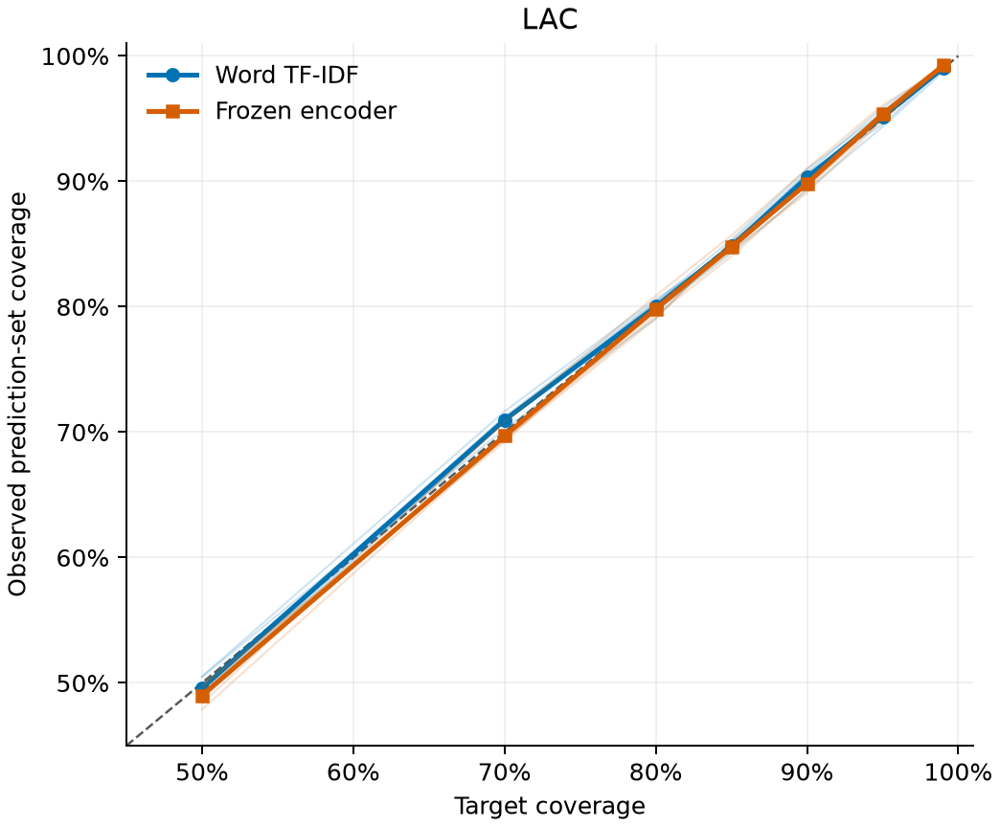
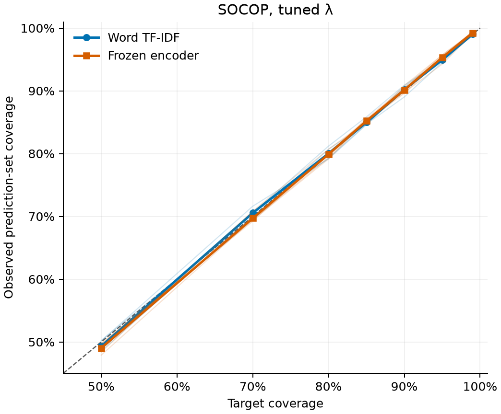

# BANKING77: does a frozen text encoder improve routing?

**The encoder improves the useful routing trade-offs in this study.** Replacing
TF-IDF raises classifier accuracy from 84.01% to 90.14%, and the benefit carries
through to LAC and tuned SOCOP. With this stronger representation, naive
confidence is also competitive: its automation/error trade-off is broadly
similar to SOCOP's when variation across seeds is considered.

## What changes, and what stays fixed?

- **Representation:** TF-IDF describes a request through its words. The frozen
  `all-MiniLM-L6-v2` encoder instead turns the request into a vector using what
  it learned during pretraining. Both representations feed logistic regression
  with the same settings, including `C=1`; neither classifier is separately tuned.
- **Data:** seeds `7, 21, 42, 84, 123` preserve identical record IDs: 7,502
  training requests, two tuning halves of 625, 1,251 final-calibration requests
  and the same 3,080 official test requests. Existing TF-IDF results are reused.
- **Decision rules:** LAC checks each intent's probability against a cutoff
  learned from calibration examples. SOCOP favors one-label sets while
  penalizing the size of the sets left for review. Lambda controls that penalty
  and is selected separately for each representation, seed and coverage target
  using only the tuning halves. Final calibration is separate. Both rules
  automate only singletons; empty and multi-label sets require review.

**Coverage** is the fraction of sets containing the correct intent, including
deferred requests. **Automated-case error** is the fraction of automatic
decisions that are wrong. Tables report arithmetic means of five per-run
metrics. Test requests are reused, and counts are not pooled across runs.

## Automation versus error

Rows pair the same method and target. Arrows mean **TF-IDF → encoder**.

| Method and coverage target | Coverage | Automation | Automated-case error |
|:--|--:|--:|--:|
| LAC, 90% | 90.31% → 89.83% | 52.85% → 86.64% | 5.37% → 5.10% |
| Tuned SOCOP, 95% | 94.93% → 95.31% | 72.49% → 88.23% | 6.93% → 5.22% |
| Tuned SOCOP, 99% | 99.02% → 99.23% | 44.90% → 65.00% | 1.70% → 1.03% |

<p>
  
  
</p>

The horizontal axis measures automation; the vertical axis measures automated
error. Further right and lower is better on these two measures. The charts use
identical axes: blue circles show TF-IDF, orange squares the encoder. Bold
curves show means; faint curves show the five runs. Points represent evaluated
settings, joined in coverage-target order.

- **LAC's main gain is substantially more automation at similar error.** At
  90%, automation rises by almost 34 percentage points. Its 70% encoder setting
  offers another balance: 71.13% automation with 2.00% error, versus 68.18% and
  5.20% for TF-IDF. It cannot replace the 90% setting when that higher coverage
  is required.
- **SOCOP improves both routing metrics in the highlighted regions.**

  - **95% target:** more automation and fewer errors than TF-IDF in all five
    runs. Compared with encoder LAC at 95%—67.36% automation and 3.39% error—it
    accepts more requests but also more mistakes.
  - **99% target:** both improvements hold in four runs, not all five. Encoder
    automation ranges from 60.16% to 66.79%, and error from 0.59% to 1.57%.
    These observed errors are not a guaranteed ceiling.
  - **More automation is not always the goal.** Encoder SOCOP at 90% routes
    98.81% of requests with 9.19% error, close to the classifier's unrestricted
    9.86% error. At 70%, the encoder instead reduces automation from 77.06% to
    71.13% while reducing error from 8.44% to 2.00%.

The curves turn back because lowering the coverage target first converts
multi-label sets into singletons, then creates more empty sets. Automation can
therefore fall even as coverage is relaxed. SOCOP also changes lambda between
targets, so its sets need not shrink in a nested sequence. Higher classifier
accuracy helps here, but does not imply improvement at every routing setting.

### Encoder routing compared with a simple confidence rule

The three policies below use the same frozen-encoder predictions. The **naive
confidence rule** accepts the model's top answer when its probability reaches
a fixed cutoff; otherwise it sends the request to review.



Here colors identify policies: **blue is LAC, orange is SOCOP and green is
naive confidence**. Bold curves show five-run means and faint curves show
individual runs.

**Naive confidence is competitive with SOCOP, with broadly similar routing
performance.** Considering the variation across seeds, this comparison does
not show a clear overall automation/error advantage for conformal prediction
with the stronger text encoder.

## Coverage remains a separate requirement

<p>
  
  
</p>

The horizontal axis is target coverage; the vertical axis is observed test
coverage. The diagonal marks agreement. The colors and mean/run distinction
match the automation charts; faint curves are not confidence bands.

- **Both representations stay close to their targets.** The routing gains are
  not explained by a general loss of coverage. At targets 90%, 95% and 99%, no
  run's saved 95% Wilson interval lies entirely below its target.
- **One encoder run falls below this interval check at 50%.** Seed 7 reaches
  47.89% coverage for both methods, with interval 46.13%–49.66%. A finite test
  result need not equal its target; these pointwise checks describe behavior,
  not a formal guarantee or acceptance test.

High coverage can come from retaining alternatives on deferred requests. It
does not make those requests automatically correct, nor guarantee low error
among the singletons.

## What remains for human review?

Deferred-set means include empty sets, not just multi-label shortlists.
Arrows again mean TF-IDF → encoder.

| Method and target | Mean set size, all requests | Mean set size, deferred requests |
|:--|--:|--:|
| LAC, 90% | 1.59 → 1.03 | 2.25 → 1.20 |
| Tuned SOCOP, 95% | 17.08 → 3.25 | 60.48 → 21.16 |
| Tuned SOCOP, 99% | 21.53 → 8.80 | 37.87 → 23.76 |

- **LAC remains the compact-set reference.** Its small overall mean reflects
  many singletons, but a deferred mean near one does not imply a usable
  one-answer shortlist: empty sets also contribute.
- **SOCOP's review burden improves, but remains substantial.** Small lambdas
  make extra labels inexpensive once a set expands beyond one label. Deferred
  means vary from 8.7 to 52.7 labels across encoder runs at 95%, and from 11.4
  to 53.4 at 99%. More automation does not ensure consistently useful shortlists.

## Conclusions

1. **The encoder substantially improves the automation/error trade-off.**
   The gains extend across both LAC and SOCOP: higher classifier accuracy,
   more favorable routing choices and smaller prediction sets, while coverage
   remains close to its target. The main improvement comes from the text
   representation, rather than changing the routing rule alone.
2. **With the encoder, conformal routing and naive confidence converge towards
   similar performance.** Naive thresholding is competitive with SOCOP, and
   the observed curves do not establish a clear overall routing advantage for
   conformal prediction once seed variation is considered. This conclusion
   concerns automation and error, not prediction-set coverage, which naive
   thresholding does not control.

### Study limitations

- The [official split limitations](../../../data/README.md#split-limitations)
  remain: unequal intent mixtures and text overlaps. Reusing one test set across
  five runs does not create five independent datasets or establish uniform
  reliability across intents.
- This is exploratory: previous test inspection and lambda-grid expansion
  preceded the encoder study. Pretraining exposure to BANKING77 is unknown.
  Fixed classifier settings do not compare optimally tuned models, and the
  results do not isolate a particular semantic mechanism behind the gain.
- Encoding all 13,083 records took 20.72 seconds on CPU, including loading the
  already-downloaded model. Vectors were cached once. This describes this run's
  practical cost, not a hardware benchmark.

## Reproduce

Follow the [preparation and evaluation guide](../../../examples/banking77_representations/README.md).
With saved results available, run:

```bash
python -m examples.banking77_representations.compare
```

This reuses the conformal results and evaluates fixed confidence cutoffs on
cached encoder probabilities, without training, tuning or recalibration. It
writes `metrics_summary.csv`, `encoder_naive_metrics.csv`,
`encoder_naive_summary.csv`, `manifest.json` and five plots under
`outputs/banking77/representation_comparison/comparison/`. Figures here are
reviewed snapshots; refresh them together with the reported numbers.
