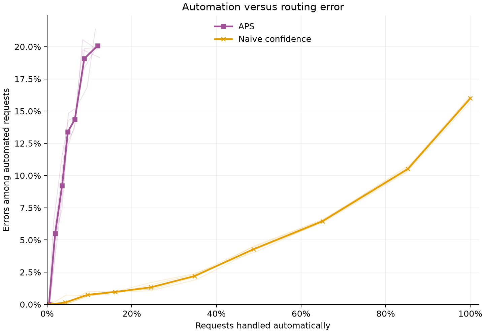

# BANKING77: APS and singleton routing

The implemented APS method tracks the coverage targets reasonably closely, but
is a poor singleton router with these TF-IDF/logistic-regression probabilities.
At the 90% target, it automates only **3.53%** of requests, with **9.22% error
among automated cases**. Most requests produce large sets or empty sets and
therefore require review. This result concerns the particular deterministic APS
convention and model used here, not every method called APS.

The [shared comparison](comparison.md) describes the prepared predictions,
data-split limitations and reproduction commands. APS uses the same five models
and final-calibration records as the other conformal methods; it needs no tuning.

## What the results show

Values are arithmetic means of five per-seed metrics. Every seed evaluates the
same 3,080 official test requests; the means are descriptive, not estimates from
five independent test samples. Error uses only automated requests as its
denominator, whereas coverage and automation use all requests.

| Nominal coverage | Observed coverage | Mean set size | Automation | Automated-case error |
|:---|---:|---:|---:|---:|
| 99% | 99.17% | 49.64 | 0.44% | 0.00% |
| 90% | 90.10% | 21.74 | 3.53% | 9.22% |
| 70% | 70.36% | 7.18 | 8.77% | 19.08% |
| 50% | 50.17% | 2.85 | 11.94% | 20.08% |

Smaller sets do not automatically make the routing policy useful. Even at the
50% coverage target, automation reaches only 11.94%, with more than one error
per five automated requests. Conversely, zero observed errors at the 99% target
come from just 9–21 automated requests per seed. Their pointwise 95% Wilson
upper error bounds are 15.46–29.91%, not zero.

The horizontal axis is automation; the vertical axis is error among automated
requests. Purple denotes APS and orange the naive confidence rule. Faint paths
show individual seeds; bold paths connect the five-seed means in policy-parameter
order. They are evaluated operating points, not an interpolated optimal frontier
or confidence bands.

At the 90% target, the tested naive cutoff `tau=0.8` automates **4.24%** with
**0.14%** automated-case error. It improves both routing outcomes over APS in
every paired seed. This is a comparison of observed routing outcomes, not equal
coverage guarantees: the naive policy does not construct a calibrated prediction
set. At the 70% target, APS's mean automated error, 19.08%, even exceeds the
15.99% error obtained by routing every request with the underlying classifier.
Deferring most cases has not isolated a reliably easier subset.

## Why does APS automate so little?

The [implemented score](../../../src/conformal_selective_prediction/scores.py)
sorts probabilities from largest to smallest, preserves class order for ties,
and accumulates probability **through the candidate label itself**. The
[set rule](../../../src/conformal_selective_prediction/prediction_sets.py)
includes labels whose score is at most the calibrated threshold `q`. It neither
randomizes the boundary nor adds the label that crosses it.

Writing the largest probabilities as `p1` and `p2`, a singleton therefore needs
`p1 <= q < p1 + p2`. Two consequences explain the observed pattern:

- If `p1 > q`, the entire set is empty. For example, a top probability of 0.8
  with a calibrated threshold of 0.7 excludes even the model's favorite answer.
- When probability is spread across many of the 77 labels, many labels can fit
  below the cumulative threshold, producing a large multi-label set.

At the 90% target, 9.01% of sets are empty and 87.47% contain multiple labels.
Only the remaining 3.53% are automated. Coverage near 90% therefore says little
about the usefulness of this selected subset.

This configuration is not competitive for singleton routing in the observed
comparison. That conclusion should not be transferred to crossing-label or
randomized APS variants, different representations, or a different deployment
distribution. Marginal set coverage is not a guarantee on automated-case error.
