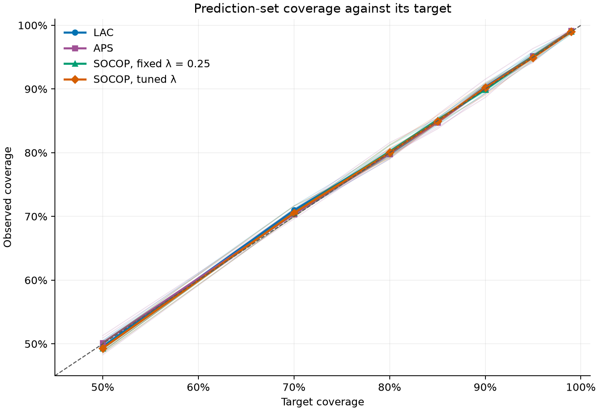
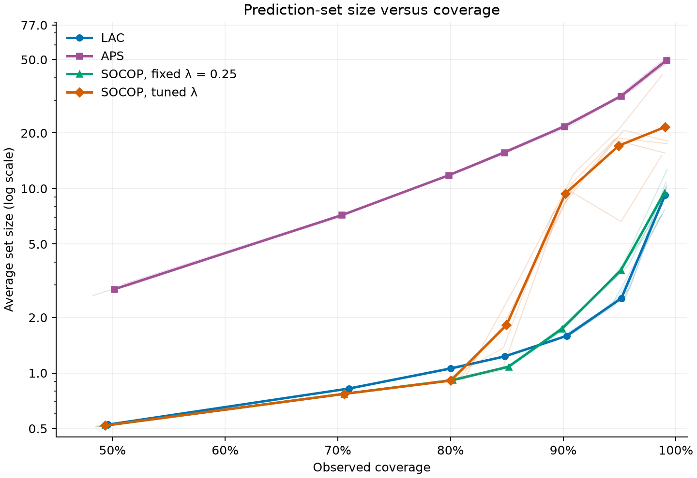

# BANKING77: which score helps automation?

**The best trade-off depends on the goal:** more automation, fewer routing errors,
or higher prediction-set coverage. With the same TF-IDF classifier, tuned SOCOP
stands out for combining high coverage with substantial automation at its 95%
and 99% targets. LAC and naive confidence remain competitive at several settings;
the implemented deterministic APS is not competitive for singleton routing.
No method is the best choice for every requirement.
The [APS](aps.md) and [SOCOP](socop.md) reports explain those behaviors in detail.

## What is being compared?

- **One classifier, different decision rules.** Each run fits word TF-IDF and
  logistic regression on 7,502 requests. All methods reuse its saved probabilities;
  classifier accuracy averages 84.01%.
- **Separate examples for tuning and calibration.** Of the remaining official
  training records, 1,250 are reserved for SOCOP tuning in two halves of 625.
  A separate 1,251 records calibrate every conformal method. LAC and APS leave
  the tuning halves unused. The
  [historical LAC study](../../banking77_validation.md) used 2,501 calibration
  records, so its numbers must not be substituted for the fresh LAC controls here.
- **The same test requests in every run.** Seeds `7, 21, 42, 84, 123` change the
  training/tuning/calibration split, not the 3,080 official test requests.
  Reported means average five per-run metrics, not independent test datasets.
- **Different settings, not different models.** Conformal coverage targets are
  99%, 95%, 90%, 85%, 80%, 70% and 50%. The naive confidence cutoff runs from
  0 to 1 in steps of 0.1. SOCOP uses either fixed λ = 0.25 or a separate
  tuning-selected λ for each seed and coverage target.

**Coverage** measures whether the prediction set contains the correct intent.
Only one-label sets are automated; empty and multi-label sets go to review.
**Automated-case error** measures mistakes among those automated requests, not
among all test requests. A 90% coverage target is not a promise of 90% accuracy
on the automated subset.

## At the same 90% coverage target

This reference target was already used by the baseline. The table shows the
five-run means on the official test set, not the best point selected from each
method's curve.

| Method | Coverage | Average set size | Automation | Automated-case error |
|:--|--:|--:|--:|--:|
| LAC | 90.31% | 1.59 | 52.85% | 5.37% |
| APS, deterministic | 90.10% | 21.74 | 3.53% | 9.22% |
| SOCOP, fixed λ = 0.25 | 89.88% | 1.74 | 80.13% | 12.21% |
| SOCOP, tuned λ | 90.19% | 9.41 | 88.32% | 11.09% |

- **LAC automates about half the requests with relatively compact sets.** It
  makes fewer errors among automated requests than either SOCOP variant at
  this target, but also handles fewer requests. This is a different balance,
  not an improvement on every measure.

- **APS is a poor automation fit here.** Both its multi-label and empty sets
  cause deferral. Its [deterministic rule](aps.md#why-does-aps-automate-so-little)
  can even exclude a high-confidence top answer; this is not a conclusion about
  every APS variant or classifier.

- **SOCOP favors more singletons, with different costs for the two variants.**

  - **Fixed SOCOP** has a mean size close to LAC's, yet automates substantially
    more requests. Similar average sizes hide different mixtures of empty,
    one-label and multi-label sets; automated error is also higher here.
  - **Tuned SOCOP** automates still more by tolerating large sets on the
    remaining requests. Its deferred sets average about 73 of the 77 intents:
    useful for deciding to review, but barely a shortlist for the reviewer.

The similar coverage values therefore do not identify the best routing policy.
The next plot also includes naive confidence, which does not construct a
prediction set calibrated to a coverage target.

## Automation versus error across settings


Moving right means handling more requests; moving down means fewer mistakes as
a fraction of those handled. Bold marked curves show split means; faint curves
show individual runs. Points follow parameter order, so lines may turn back.
They connect evaluated settings, not predictions at untested cutoffs.

- **LAC has a clear local advantage, not overall dominance.** At the 70% target,
  it automates 68.18% with 5.20% error, versus 65.06% and 6.46% for naive cutoff
  0.2. Both improvements hold in every split. This is not an eligible alternative
  if 90% prediction-set coverage is required.

- **APS's low automation does not consistently buy low error.** At the 90%
  target, naive cutoff 0.8 automates 4.24% with 0.14% error, improving on APS's
  two routing metrics in every split. Most APS requests require review, yet
  the selected subset is not reliably more accurate. This supports keeping
  this configuration as a comparator rather than the preferred routing rule.

- **SOCOP offers two particularly interesting tuned settings**, followed by
  a region where additional automation admits many more errors:

  - **95% coverage target: more automation.** It handles 72.49% of requests
    with 6.93% mean error, versus 65.06% and 6.46% for naive cutoff 0.2.
    Compared with its own 99% setting, it roughly halves the review load,
    from 55.10% to 27.51%. The gain comes with more errors among automated
    requests, not an improvement on both measures.

  - **99% coverage target: fewer errors.** It automates 44.90% with 1.70% mean
    error, versus 34.84% and 2.20% for naive cutoff 0.4. Both improvements
    hold in four seeds. However, its errors range from 0.99% to 2.75%, so the
    mean below 2% is not an error ceiling. This favorable tested comparison
    does not establish superiority over every possible naive cutoff.

  - **The highest automation is not the best reliability result.** At the
    tested 85% target, tuned SOCOP reaches 98.68% automation and 15.23% error:
    almost all requests and almost the original classifier's error.

  - **The curves turn back because the reason for review changes.** At high
    coverage targets, multi-label sets limit automation. Lowering the target
    initially creates more singletons, then more empty sets, so automation
    falls again. Opposite branches can automate different requests and have
    different errors even at similar automation rates. The
    [SOCOP report](socop.md#why-the-routing-curves-turn-back) explains the loop
    and the separate effect of tuning lambda.

- **Naive confidence remains competitive, including at high automation.**
  Cutoff 0.1 gives 85.27% automation with 10.52% error, versus 88.32% and 11.09%
  for tuned SOCOP at the 90% target. That naive point also beats fixed SOCOP
  at 90% on both routing metrics in every split. It is a useful baseline for
  automation and error, but does not provide conformal prediction-set coverage.

## Prediction-set coverage



The horizontal axis shows the requested coverage; the vertical axis shows the
fraction of test requests whose set actually contains the correct intent. This
includes both automated and deferred requests. The diagonal marks exact agreement.
Bold curves show five-run means; faint curves show individual runs, not confidence
bands.

Every method's mean is within one percentage point of its target across the
tested grid. Each score has its own calibrated threshold, so similar coverage
is expected even when routing decisions differ substantially.

- **LAC provides the reference coverage behavior.** Its 90.31% coverage at the
  90% target illustrates the close agreement across the grid. Returning more
  compact sets does not prevent it from retaining the correct answer at the
  requested rate in these experiments.

- **APS also follows the targets despite its poor routing results.** Its
  90.10% coverage at the 90% target is close to LAC's. Its low automation and
  high automated error therefore cannot be explained by a general failure
  to reach the coverage target; the problem is which sets become singletons.

- **SOCOP changes automation more than aggregate coverage.**

  - **Fixed SOCOP** reaches 89.88% coverage at the 90% target and 98.98% at 99%.
  - **Tuned SOCOP** reaches 94.93% at the 95% target and 99.02% at 99%. These
    settings combine different automation rates with near-target coverage,
    rather than gaining automation by systematically missing the target.

- **Naive confidence is absent from this plot.** It chooses whether to accept
  the top answer, rather than constructing a set calibrated to a coverage
  target. Its observed routing error is compared in the preceding plot.

Coverage above the classifier's roughly 84% accuracy comes from retaining
alternatives: a multi-label set can contain the correct intent even when the
top answer is wrong. That request still requires review; the classifier has not
become 99% accurate at automatic routing. All four conformal configurations pass
this descriptive coverage check, but it does not identify the best routing
policy. Variation between runs, weak coverage for some intents and the unequal
calibration/test intent mixtures still matter.

## Prediction-set size



The horizontal axis shows observed coverage and the vertical axis the average
number of retained intents, **including empty sets and singletons**. The size
axis is logarithmic: equal vertical distances represent multiplicative changes,
not equal numbers of labels. Bold and faint curves again show means and
individual runs. Comparing methods at similar coverage reveals how many labels
they retain to keep the correct answer available.

- **LAC is a useful compact-set reference.** Its mean size at the 99% target
  is 9.20, much smaller than tuned SOCOP's 21.53 or APS's 49.64. This makes LAC
  relevant when shortlists themselves matter, not just the number of requests
  automated. Small average size alone does not guarantee more singletons.

- **APS pays a large set-size cost without a routing benefit here.** Its mean
  grows from 21.74 intents at the 90% target to almost 50 of the 77 intents at
  99%. The cumulative-probability rule can retain many labels when probability
  is spread across the catalogue. These broad sets preserve coverage but
  usually cannot trigger automatic routing and leave many alternatives for a
  reviewer. The [APS report](aps.md#why-does-aps-automate-so-little) also explains
  why its empty sets can exclude high-confidence requests.

- **SOCOP makes the cost of additional singletons visible.**

  - **Fixed SOCOP** remains relatively compact: its mean size of 9.52 at the
    99% target is close to LAC's. Similar averages still hide different mixtures
    of set sizes, which explains their different automation rates.

  - **Tuned SOCOP** exchanges compact sets for more singletons. Small selected
    lambdas make extra labels inexpensive once a request receives a multi-label
    set. At the 90% target, the overall mean is 9.41, but 88.32% of requests
    have one label; deferred sets average about 73 labels. Fewer requests need
    review, but their sets do much less to narrow the reviewer's choices.

  - **The steep rise above the 85% target** marks the transition from almost
    all singletons to more broad review sets. Their sizes vary visibly across
    runs, with different selected lambdas and calibration thresholds.

- **Naive confidence** does not produce calibrated prediction sets, so it has
  no set-size curve here.

For LAC and both SOCOP variants, an average below one at the 50% target reflects
many empty sets, not exceptionally precise one-label decisions. Roughly 48% of SOCOP sets
are empty there and require review: smaller averages can accompany lower
coverage and reduced automation.

For this application, minimizing average size and maximizing useful automation
are different objectives. LAC offers compact sets; tuned SOCOP can route more
requests while leaving broader sets for review. This APS configuration offers
neither competitive singleton routing nor compact shortlists. Choosing between
LAC and SOCOP still requires the automated-error plot and a clear view of what
the human reviewer needs from a deferred prediction set.

## What these results do not establish

- **Reliability is not uniform across intents.** At the 90% target, tuned SOCOP
  covers `virtual_card_not_working` only 30.5% of the time on average, despite
  90.19% overall coverage. Each intent has just 40 unique test requests, reused
  across runs. The saved class-level tables are important diagnostics, not
  evidence of a class-by-class guarantee.
- **The official split has limitations.** Training and calibration have an
  uneven mix of intents, while the test set has 40 examples per intent. Six
  normalized text values also overlap between the official splits. As explained
  in the [data guide](../../../data/README.md#split-limitations), measured coverage
  does not establish that calibration and future requests follow the same
  distribution. Saved pointwise Wilson intervals are approximate diagnostics;
  counts are not pooled across repeated test evaluations.
- **This remains an exploratory comparison.** SOCOP's grid was extended after
  preliminary results had been inspected, although λ selection itself uses
  tuning data only. There is no specified acceptable error rate or review
  capacity, and no test-selected setting is presented as an optimal policy.

## Conclusions and next step

**The preferred trade-off depends on what the application needs:** how many
requests must be automated, how many routing errors are acceptable, and what
prediction-set coverage is required. Review capacity also matters, including
whether a deferred set is a useful shortlist or almost the full intent catalogue.

- **LAC remains a strong reference for compact sets and moderate automation.**
  Its local advantage over a tested confidence cutoff is useful, but a lower
  coverage setting cannot substitute for a stricter coverage requirement.

- **APS is not the preferred singleton router in this study.** Its near-target
  coverage does not compensate for low automation and a poorly selected
  automated subset. This conclusion concerns the implemented configuration,
  not every APS variant or model.

- **Tuned SOCOP stands out for combining high coverage with substantial
  automation**, with two operating points worth carrying into the next study:

  - **95% coverage** favors more automation and a lower review load, accepting
    more mistakes among automated requests.
  - **99% coverage** favors fewer errors and improves both routing metrics
    over one tested naive setting in most runs, while leaving more work for
    human review. It still does not enforce an automated-error ceiling.

  These are promising choices for different goals, not universally optimal
  settings. Broad deferred sets and weak intent-level coverage remain costs.

- **Naive confidence remains competitive at several settings.** It should stay
  in the comparison when evaluating automation and error, while recognizing
  that it does not supply conformal prediction-set coverage control.

The next study should compare a frozen text encoder with TF-IDF before the LLM
phase, checking whether these routing trade-offs improve when the probabilities
come from a different representation. The present results do not establish that
more complex scores alone solve the automation problem.

## Reproduce and inspect

Use Python 3.12, install `.[example]`, and follow the
[data setup](../../../data/README.md#download). From the repository root:

```bash
python -m examples.banking77_scores.prepare
python -m examples.banking77_scores.lac
python -m examples.banking77_scores.aps
python -m examples.banking77_scores.socop
python -m examples.banking77_scores.compare
```

If the experiment outputs already exist, run only the last command. It checks
the shared preparation metadata, record IDs, class order, grids and naive
results, then reads saved metrics without fitting, recalibrating or tuning.

Outputs go to `outputs/banking77/score_comparison/comparison/`: two summary CSVs,
a manifest and five PNGs under `figures/`. CSV ranges describe split variation,
**not confidence intervals**. Undefined errors are not plotted as zero. The
figures beside these reports are reviewed copies; rerunning does not overwrite
them. Refresh those snapshots and reported numbers together after review.
