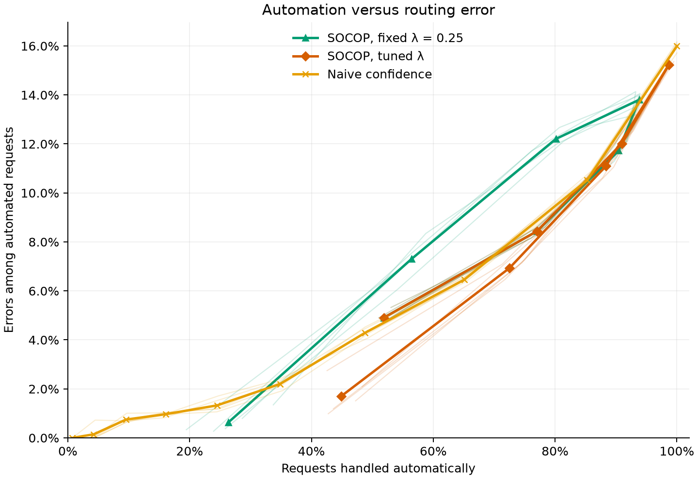

# BANKING77: singleton-oriented SOCOP

Two SOCOP settings are worth carrying forward. At the **95% coverage target**,
tuned SOCOP automates **72.49%** of requests with **6.93% mean error among
automated cases**. At **99%**, it automates **44.90%** with **1.70% mean error**.
The first handles more work; the second makes fewer mistakes among the requests
it handles. Neither maximizes automation, which would admit much of the original
classifier's error.

See the [shared comparison](comparison.md) for the common data protocol,
uncertainty limitations and reproduction commands.

## Fixed reference and tuning-selected configurations

The full [SOCOP score](https://arxiv.org/html/2509.24095v2) balances a multi-label
penalty against a per-label cost controlled by positive `lambda`. We compare
fixed `lambda=0.25` with separate tuning for each seed and coverage target.

For each candidate, calibrate on tuning half A and evaluate on B, then swap.
Each half contains 625 requests. Choose the highest mean frequency of **exactly
one label**, breaking ties by smaller mean set size and then smaller lambda,
using integer counts for exact comparisons. Automated-case error is not optimized.
Choices are frozen before recalibration on the independent 1,251-record
final-calibration partition and evaluation on the official test set.

The reported grid is `0.001, 0.003, 0.01, 0.05, 0.1, 0.25, 0.5, 1.0`.
It was extended with `0.001` and `0.003` after preliminary test results had been
inspected, then frozen for this run. Although individual lambda choices still
use tuning data only, the expanded-grid comparison is **exploratory**, not a
confirmation on an untouched test set.

### Selected lambda by nominal coverage

| Seed | 99% | 95% | 90% | 85% | 80% | 70% | 50% |
|---:|---:|---:|---:|---:|---:|---:|---:|
| 7 | 0.01 | 0.01 | 0.001 | 0.001 | 0.001 | 0.001 | 0.001 |
| 21 | 0.05 | 0.01 | 0.01 | 0.001 | 0.001 | 0.001 | 0.001 |
| 42 | 0.05 | 0.05 | 0.01 | 0.001 | 0.001 | 0.001 | 0.001 |
| 84 | 0.05 | 0.01 | 0.01 | 0.001 | 0.001 | 0.001 | 0.001 |
| 123 | 0.05 | 0.01 | 0.01 | 0.05 | 0.001 | 0.001 | 0.001 |

At targets of 80% and below, several lambdas tie on both singleton count and set
size; the smaller-lambda tie-break selects 0.001. At 50%, the entire grid ties.
The boundary is therefore not evidence that still smaller values would improve
automation. Changing lambda across targets also means tuned sets need not be
nested; fixed-lambda sets retain that property.

## What tuning changes at the 90% target

The table shows arithmetic means of five per-seed metrics, not pooled error
rates. SOCOP rows use the 90% nominal coverage target; the naive row is the
actual tested `tau=0.1` cutoff, not a matched-coverage policy.

| Setting | Observed set coverage | Automation | Automated-case error | Mean set size |
|:---|---:|---:|---:|---:|
| SOCOP, fixed 0.25 | 89.88% | 80.13% | 12.21% | 1.74 |
| SOCOP, tuned | 90.19% | 88.32% | 11.09% | 9.41 |
| Naive, tau = 0.1 | Not applicable | 85.27% | 10.52% | Not applicable |

Tuning improves automation over fixed SOCOP in all five seeds, but improves
automated-case error in only four. Compared with naive `tau=0.1`, tuned SOCOP
automates more **and makes more errors among automated requests** in every seed.
At this target, tuning helps the singleton objective, but does not establish
a better automation/error trade-off than the naive rule.

The second cost is hidden by singleton frequency: at the 90% target, tuned
SOCOP defers 11.68% of requests, with no empty sets and roughly **73 labels per
deferred set**, averaging the five per-seed conditional means. Small lambda
makes additional labels cheap once the multi-label penalty has been paid.
The method can therefore retain many singleton decisions while covering
difficult requests with nearly the whole 77-label catalogue. This helps the
automation objective but offers little narrowing for a human reviewer.

## Why the routing curves turn back

Moving right means more automation; moving down means fewer errors among the
automated requests. Faint paths show seeds; bold paths connect their means as
each rule's setting changes. SOCOP's two branches are not optimization instability:
they reflect two different reasons for deferring requests.

- **At high coverage targets, multi-label sets limit automation.** Keeping
  alternative intents helps retain the correct answer, but those requests
  require review. Lowering the target lets more sets become singletons.
- **Around the tested 85% target, almost everything is automated.** Tuned SOCOP
  reaches 98.68% automation with 15.23% error, close to the classifier's 15.99%
  error when every request is routed. Little useful filtering remains. The
  location of this peak is specific to these results, not a universal optimum.
- **Lower targets then create empty sets.** These also require review, so
  automation falls again. At 70%, fixed and tuned SOCOP coincide at 77.06%
  automation and 8.44% error; every deferred set is empty. The remaining
  automated subset is more accurate here, despite the lower set coverage.

Similar automation rates on opposite branches can therefore select different
requests and have different errors. The lines connect tested settings, not an
optimal frontier. Tuning also changes lambda between targets; only the fixed
lambda guarantees nested sets as the target changes.

## The 95% and 99% targets: two useful operating points

The **95% coverage target** offers a higher-automation balance: 72.49% automation
with 6.93% mean error. Naive `tau=0.2` gives 65.06% and 6.46%, so SOCOP handles
about 7.42 percentage points more requests with 0.47 percentage points more
error among those handled. This is a useful trade-off if the additional errors
are acceptable, not a win on both measures. It leaves 27.51% of requests for
review, compared with 55.10% at the 99% target.

The tuned curve's low-error endpoint uses the **99% coverage target**. Its
44.90% automation and 1.70% error compare favorably with naive `tau=0.4`, at
34.84% and 2.20%: about ten percentage points more automation with fewer errors
among those handled. Both improvements hold in four of five seeds. Fixed SOCOP
at the same coverage target is more conservative, automating 26.32% with 0.62%
error. Tuning buys throughput, not the lowest error.

Both targets deserve attention for different operating needs, but neither
enforces an automated-error limit. In particular, **1.70% is an average, not an
error ceiling**: individual runs range from 0.99% to 2.75%. Naive `tau=0.5`
instead gives 1.33% mean error at 24.49%
automation. These are useful observed trade-offs, not a matched-error comparison
or proof that an untested naive cutoff could not compete.

## Coverage: close to target, but not uniform protection

Both SOCOP variants track the coverage targets closely in the
[coverage figure](comparison.md#prediction-set-coverage). At the 99% target, fixed
and tuned SOCOP reach 98.98% and 99.02% mean coverage respectively. Tuned SOCOP
reaches 94.93% at the 95% target, 90.19% at 90%, and 70.55% at 70%.
The routing curves turn back even while coverage continues to follow the target:
retaining the correct intent and returning exactly one intent are different goals.

Coverage counts both correct singleton decisions and deferred sets containing
the correct intent. A very large deferred set can therefore help coverage without
helping the reviewer choose an answer. Equally, 99% set coverage does not imply
less than 1% error among automated requests: that error rate uses only the
automated subset as its denominator.

The aggregate also hides a serious weakness. At the 90% target, tuned SOCOP's
coverage for `virtual_card_not_working` averages only **30.5%**, versus 90.19%
overall. The shared test records and unequal calibration/test intent mixtures
further limit the conclusion; the [joint report](comparison.md#what-these-results-do-not-establish)
explains why measured agreement does not establish a deployment guarantee.

## Conclusion

- **Carry both the 95% and 99% settings forward.** The 95% target offers more
  automation with higher error; the 99% target favors lower error and improves
  both routing metrics over a tested naive setting in most runs. Their value
  depends on acceptable error and available review capacity.
- **Do not treat maximum singleton rate as the deployment objective.** Near-total
  automation retains nearly all the classifier's error; lambda tuning does not
  enforce an acceptable error rate.
- **Coverage is useful but insufficient for routing decisions.** Large review
  sets and weak intent-level coverage remain material costs, even when aggregate
  coverage is on target.
