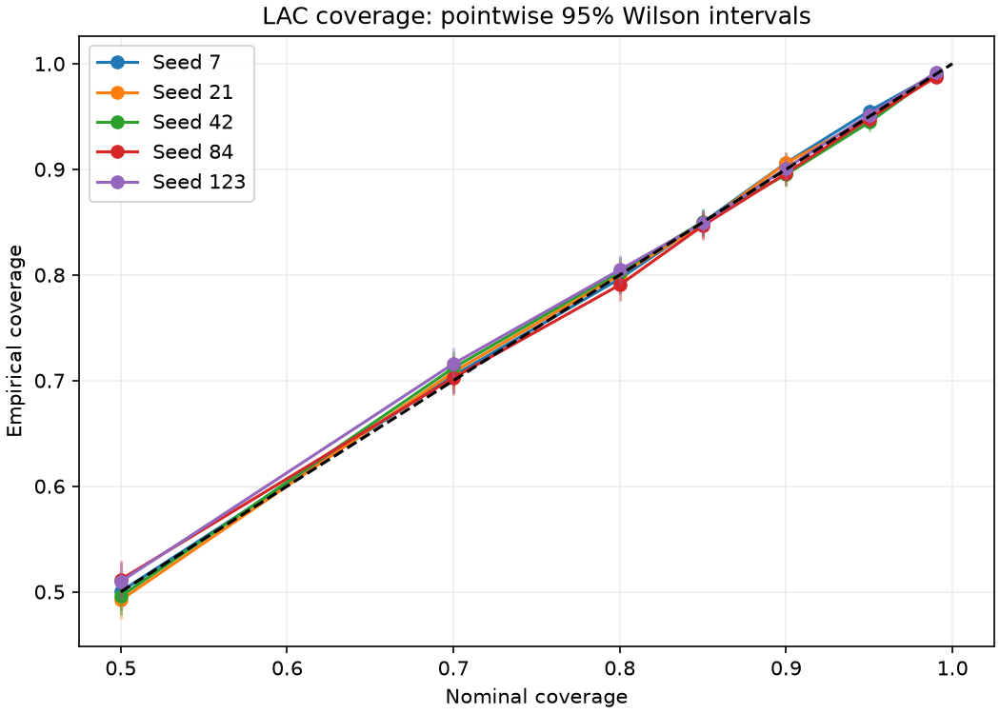
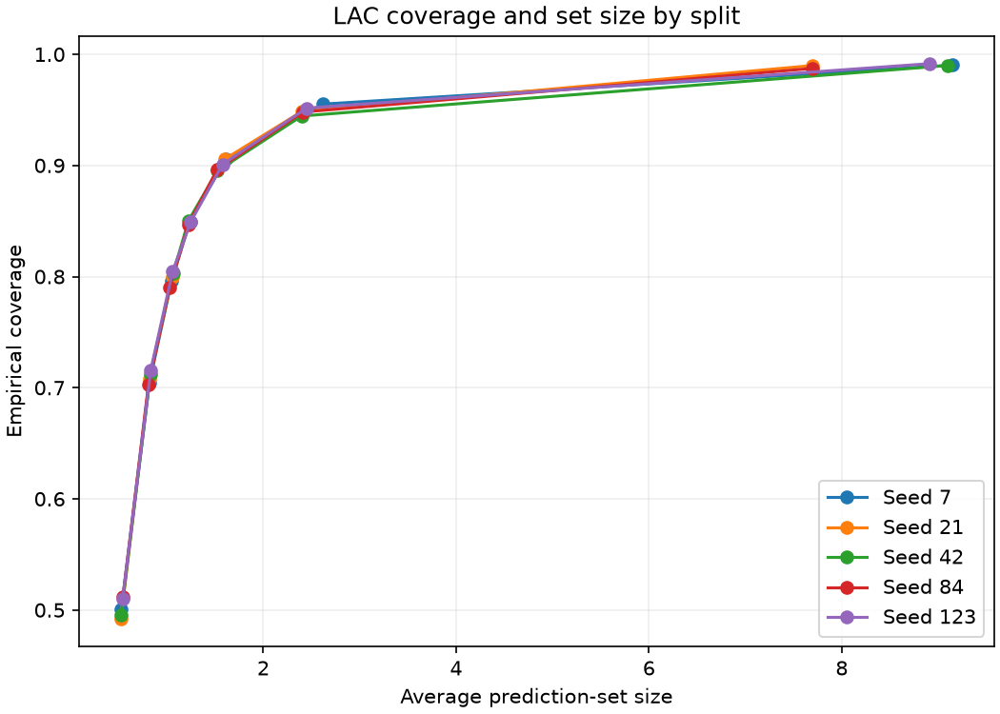
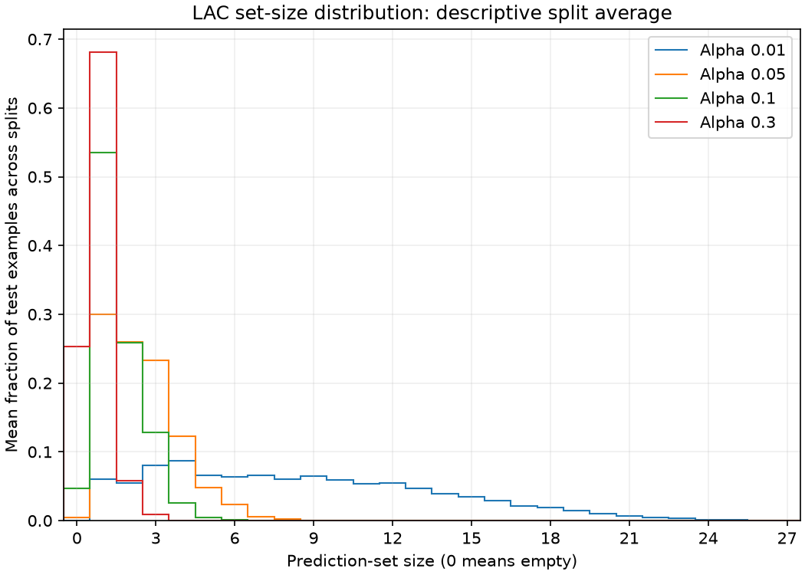

# BANKING77 baseline validation

The TF-IDF/logistic-regression baseline reaches 90.08% mean empirical coverage
at the 90% LAC target across five training/calibration splits. Singleton selection
automates 53.49% of requests, with 5.51% error among automated cases. These
aggregate results are stable across the tested splits, but coverage varies
substantially by intent. This is a reproducible baseline, not a deployment
approval or a guarantee on automated-case error.

## Experiment setup

The [validation script](../examples/banking77_validation.py) uses the official
[BANKING77 files](../data/README.md), pinned to dataset revision
`57ec275d8078af65b7731c2a98be812d844a6d6b`.

- Split the official training data into 7,502 model-training and 2,501 calibration
  examples, stratified by intent.
- Preserve all 3,080 official test examples, with 40 examples for each of 77
  intents. Every run evaluates the same test records.
- Use split seeds `7, 21, 42, 84, 123`. Each seed changes both the training and
  calibration partitions.
- Fit word TF-IDF unigrams and bigrams followed by multinomial logistic
  regression, with L2 regularization, `C=1.0`, `lbfgs`, and at most 1,000 iterations.
  Both preprocessing and classifier fitting use only the training partition.
- Fit once per seed, then reuse calibration scores and test probabilities across
  all policy settings. No model or threshold is selected using test performance.

The LAC grid is `alpha = 0.01, 0.05, 0.10, 0.15, 0.20, 0.30, 0.50`. The naive
confidence grid runs from `0.0` through `1.0` in steps of `0.1`. Both were fixed
before evaluation. The set-size distribution figure displays only
`alpha = 0.01, 0.05, 0.10, 0.30`; the CSVs and other figures retain the full grid.

### What the two policies do

**LAC singleton selection:** calibrate a threshold `q` using true-label scores
`1 - p_y(x)` on the calibration partition. Include each label whose score is
at most `q`. Automate only if exactly one label is included; defer empty and
multi-label sets. `alpha` sets the nominal miscoverage level for the prediction
set, not the allowed error among automated decisions.

**Naive confidence thresholding:** predict the label with the highest model
probability and automate when that probability is at least `tau`. Otherwise,
defer. There is no conformal calibration step and no explicit check of the
second-best label. For example, `tau=0.8` accepts a top probability of `0.85`
but rejects `0.70`. It does not guarantee an automated-case error below 20%.

## Results at the reference settings

The following settings, `alpha=0.1` and `tau=0.5`, are inherited from the
[single-split example](../examples/banking77_baseline.py), not chosen as the best
points on these curves. Classifier accuracy averages 84.01%, with a split range
of 83.83–84.29%.

Values below are the arithmetic mean of the five per-split metrics, followed by
their minimum–maximum range in parentheses. These ranges are descriptive split
variation, **not confidence intervals**. Automated-error rates are averaged per
split, not calculated by pooling repeated test observations.

| Metric | LAC, alpha = 0.1 | Naive, tau = 0.5 |
|:-------|----------------:|----------------:|
| Prediction-set coverage | 90.08% (89.51–90.62%) | Not applicable |
| Average prediction-set size | 1.568 (1.520–1.614) | Not applicable |
| Automation rate | 53.49% (52.31–55.19%) | 24.49% (24.03–24.81%) |
| Error among automated cases | 5.51% (5.04–5.77%) | 1.33% (1.06–1.71%) |

At these settings LAC handles more requests, with more error among the handled
cases. They are different operating points, not a matched-automation comparison
or evidence that one method is generally better. Neither setting is recommended
as a deployment threshold.

## Reading the four figures

### 1. Nominal versus empirical coverage



The horizontal axis is the target coverage `1 - alpha`. The vertical axis is
the fraction of all test examples whose prediction set contains the true intent.
Each colored line represents one split. The dashed diagonal indicates agreement
between nominal and measured coverage; the vertical bars are per-split 95%
Wilson intervals.

Coverage follows the target across the grid. At the 90% target, all five
per-split intervals contain 90%. This is evidence of agreement at this operating
point, not proof of exchangeability or a requirement that every interval at every
grid point contain its target. The uncertainty limitations are discussed below.

### 2. Coverage versus average set size



The horizontal axis is the average number of labels in a prediction set; the
vertical axis is coverage. Each line again represents one split, with one point
per alpha.

Higher coverage requires larger sets in this experiment. Across splits, average
set size is 8.510 at the 99% target, 2.455 at the 95% target, and 1.568 at the 90%
target. The additional labels help retain the true intent, but multi-label sets
are deferred by the singleton policy. Smaller average sets alone do not establish
a better automation policy: empty sets also reduce the average and are deferred.

### 3. Automation versus error


The horizontal axis is the fraction of all requests automated. The vertical
axis is the fraction of those automated predictions that are incorrect. For
example, a point at `(0.60, 0.05)` would mean 600 automated requests per 1,000,
including 30 incorrect decisions, with the remaining 400 deferred.

- Blue solid lines with circles represent LAC; each point uses a different alpha.
- Orange dashed lines with squares represent naive thresholding; each point uses
  a different confidence cutoff.
- There are five traces per method, one per split. Overlapping traces are not
  confidence bands. Error intervals are retained in the CSVs, not drawn here.

The points are connected in increasing policy-parameter order, not sorted by
automation rate. Raising the naive cutoff can only reduce automation. LAC can
turn back because increasing alpha shrinks sets: a request can move from a
multi-label set (defer), to a singleton (automate), to an empty set (defer).
For example, mean LAC automation is 68.25% at `alpha=0.2` but 51.53% at
`alpha=0.5`; mean empty-set rate rises from 15.19% to 47.63%.

The curves show observed operating points, not a smooth optimal frontier. LAC
does not uniformly dominate naive thresholding. At `alpha=0.01`, LAC makes no
observed automated errors in any split, but automates only 6.03% of cases on
average. Each run selects only 170–207 cases, with a positive 95% error-interval
upper bound of approximately 1.82–2.21%. Zero observed error is not zero risk.
Points with no automated cases have undefined error (`nan`) and are omitted.

### 4. Prediction-set-size distribution



The horizontal axis counts labels per set. The vertical axis is the arithmetic
mean of the five per-split fractions at that size. Each curve is one alpha, not
one split. Size zero means an empty set; size one is the only automated bin.

At `alpha=0.01`, much of the mass is spread over multi-label sets. At `alpha=0.1`,
53.49% of sets are singletons and 4.72% are empty, on average. At `alpha=0.3`,
68.08% are singletons and 25.31% are empty. This explains why shrinking sets
initially increases automation, while further shrinkage can eventually reduce
it. Fractions are averaged descriptively; repeated test records are not treated
as additional independent observations.

## Intent-level diagnostics

Aggregate coverage hides substantial differences between intents. The three
lowest mean intent coverages at `alpha=0.1` are:

| Intent | Mean coverage | Split range |
|:-------|--------------:|------------:|
| `contactless_not_working` | 53.00% | 50.00–60.00% |
| `card_acceptance` | 60.00% | 55.00–67.50% |
| `card_swallowed` | 72.50% | 70.00–77.50% |

These are descriptive diagnostics selected after evaluation, not a separate
confirmation study or a reason to tune thresholds on the test set. Each intent
has only 40 unique test examples, reused across seeds, not 200 independent
examples. The full 77-intent results and pointwise intervals are saved in
`class_coverage.csv`. Marginal coverage does not promise nominal coverage for
each intent, and this baseline should not be described as uniformly reliable.

## Uncertainty and limitations

Coverage and automated-case error use pointwise 95%
[Wilson intervals](https://www.itl.nist.gov/div898/handbook/prc/section2/prc241.htm). Coverage
uses 3,080 test cases per split; automated error uses only the selected cases.
Intent-level intervals use 40 cases. None is a simultaneous guarantee over all
seeds, alphas, thresholds or intents. Since the same test set is reused, counts
are never pooled across seeds to construct intervals.

The [official split limitations](../data/README.md#split-limitations) matter:
training intent counts range from 35 to 187, whereas the test set has exactly
40 per intent. Calibration follows the training mixture. These fixed splits
do not establish calibration-to-test exchangeability, so global binomial
intervals are approximate diagnostics and observed coverage cannot establish
the conformal theorem's assumptions. Six text values also overlap between the
official splits after lowercasing and trimming whitespace, although there is
no exact text overlap. The official records have been preserved unchanged.

Error among automated cases is measured empirically. No acceptable operational
error budget, human-review capacity or intent-specific requirement has been
specified, and no deployment policy is selected here.

## Conclusions and next work

This completes the documented TF-IDF baseline with LAC and naive thresholding:
coverage tracks its target, coverage and set size change in the expected
direction with alpha, and aggregate results vary little across the tested
splits. Singleton selection gives a measurable automation-versus-error trade-off,
but it has no automatic-error guarantee and weak coverage for some intents.

The next comparisons are a frozen pretrained encoder versus TF-IDF, and APS
versus LAC on the same data protocol. Neither is assumed to improve the baseline.
Those comparisons remain outstanding before the LLM phase; this report does not
mark the broader Phase 1 acceptance gate as complete.

## Reproduce the report

The code snapshot for these results is commit `3ed6f5f`. Recorded library versions
are NumPy `2.4.6`, scikit-learn `1.9.0` and Matplotlib `3.11.1`.

From the repository root, use Python 3.12, follow the pinned
[data download instructions](../data/README.md#download), then run:

```bash
python -m pip install -e ".[example]"
python examples/banking77_validation.py
```

The script writes the following files to Git-ignored `outputs/banking77/`.
Rerunning replaces the same-named files in that directory.

| File | Contents |
|:-----|:---------|
| `config.json` | Seeds, grids, confidence level and library versions |
| `lac_metrics.csv` | Per-split LAC coverage, set size and selection metrics, with counts and intervals |
| `naive_metrics.csv` | Per-split naive selection metrics, with counts and intervals |
| `class_coverage.csv` | Coverage and counts for each intent, split and alpha |
| `set_sizes.csv` | Set-size counts and fractions, including empty sets |
| Four `.png` files | The figures shown above |

The copies in `docs/figures/banking77/` are versioned report snapshots; running
the experiment does not overwrite them. After reviewing a new run, update the
reported numbers and refresh the four copies together:

```bash
for filename in nominal_vs_empirical_coverage.png coverage_vs_set_size.png \
    automation_vs_error.png set_size_distribution.png; do
    cp "outputs/banking77/$filename" "docs/figures/banking77/$filename"
done
```
